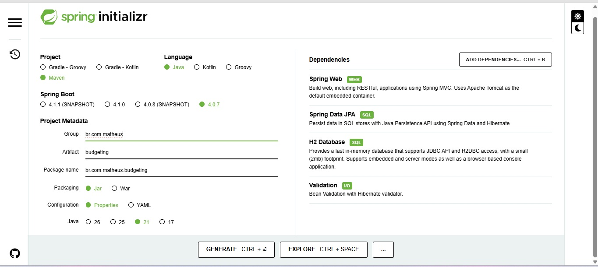
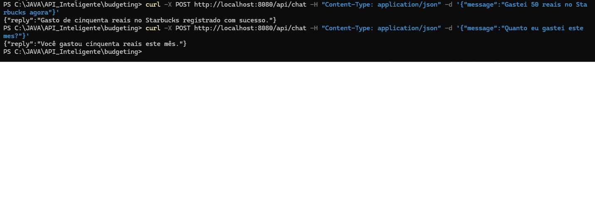
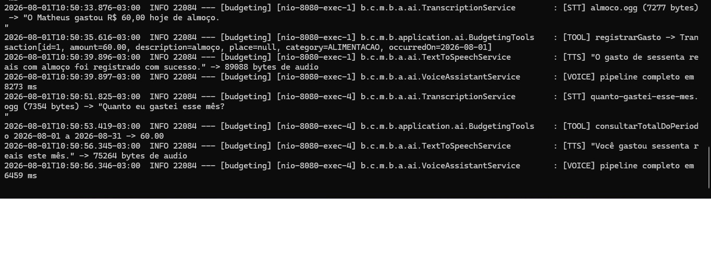
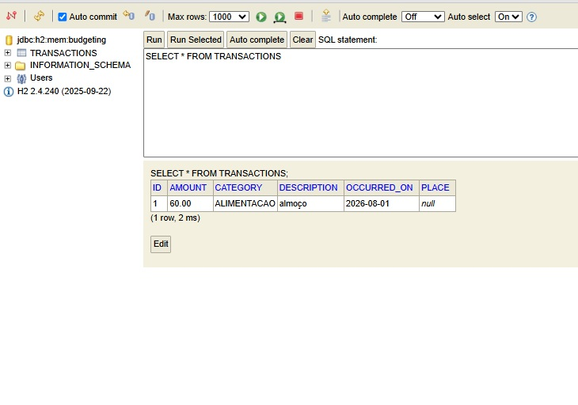
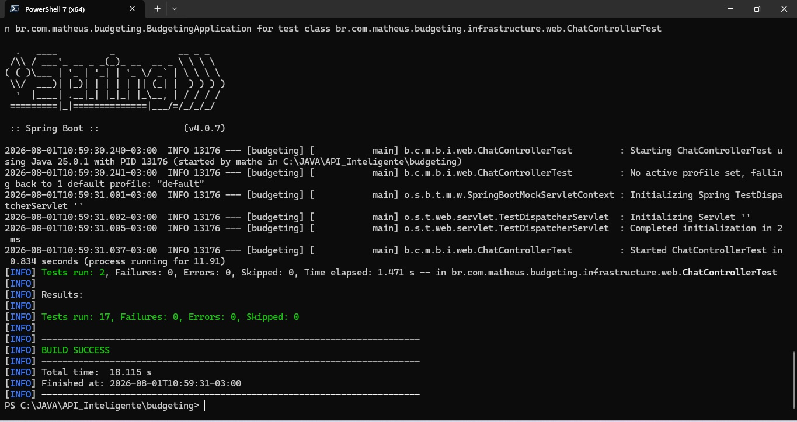
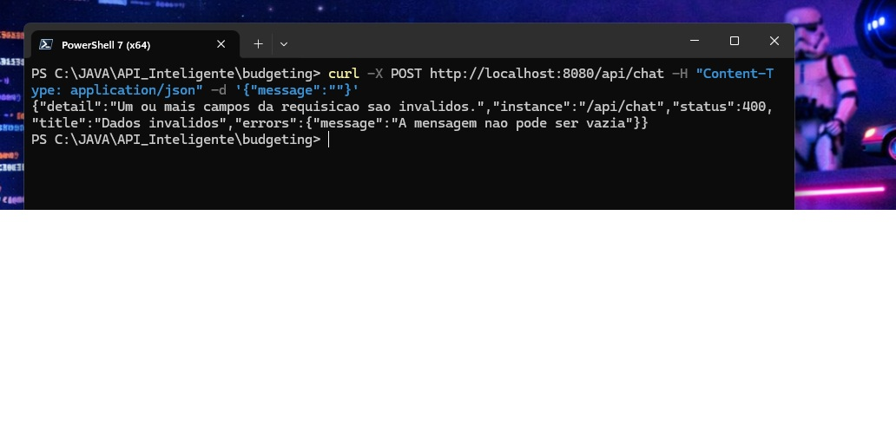

# 🤖 Budgeting — API Inteligente com Reconhecimento de Fala

Assistente financeiro pessoal comandado por **voz**, construído com **Spring Boot 4** e **Spring AI 2**.

Você fala *"Gastei 50 reais no Starbucks agora"* e a API transcreve o áudio, entende a intenção,
**executa uma função Java real** que persiste a transação no banco, e responde falando.

Desafio final da trilha [Spring Boot da DIO](https://github.com/digitalinnovationone/dio-spring-boot-learning-track).

**[O que faz](#o-que-o-projeto-faz)** · **[Arquitetura](#arquitetura)** ·
**[Tecnologias](#tecnologias)** · **[Como executar](#como-executar)** ·
**[Endpoints](#endpoints)** · **[Testar o fluxo principal](#como-testar-o-fluxo-principal)** ·
**[Ferramentas da IA](#ferramentas-expostas-à-ia-tool-calling)** · **[Testes](#testes)** ·
**[Melhoria implementada](#melhoria-implementada)** · **[Decisões técnicas](#decisões-técnicas)** ·
**[O que aprendi](#o-que-aprendi)**

---

## O que o projeto faz

```
  áudio (.ogg/.m4a/.mp3)
        │
        ▼
  1. Speech-to-Text ─────────── Whisper
        │  "Gastei 50 reais no Starbucks agora"
        ▼
  2. LLM + Tool Calling ─────── gpt-4o-mini
        │  decide chamar registrarGasto(valor=50.00, categoria=ALIMENTACAO, ...)
        ▼
  3. Use Case Java ──────────── regra de negócio + JPA
        │  INSERT INTO transactions
        ▼
  4. Text-to-Speech ─────────── gpt-4o-mini-tts
        │
        ▼
  áudio de resposta (.mp3)
```

O ponto central do projeto **não é usar IA** — é conectar IA a uma aplicação real sem
que ela fure as fronteiras do código. A IA nunca fala com o banco: ela solicita a execução
de um caso de uso, que é código Java comum, testável e que funcionaria igual atrás de um
formulário web.

---

## Arquitetura

```
br/com/matheus/budgeting/
├── domain/                    ← núcleo. ZERO import de framework.
│   ├── model/                 Transaction, Category
│   └── repository/            TransactionRepository (porta)
│
├── application/               ← casos de uso e a ponte com a IA
│   ├── usecase/               RegisterTransactionUseCase, QueryTransactionsUseCase
│   └── ai/                    AssistantService, BudgetingTools (@Tool),
│                              TranscriptionService, TextToSpeechService,
│                              VoiceAssistantService, ChatClientConfig
│
└── infrastructure/            ← adaptadores
    ├── persistence/           TransactionEntity, JpaRepository, RepositoryAdapter
    └── web/                   Controllers + GlobalExceptionHandler
```

Regras que o projeto segue:

- **`domain/` não importa nada de framework.** `Transaction` é um `record` puro, com validação
  no construtor compacto. Compilaria num projeto Java sem Spring.
- **A porta é declarada pelo domínio** e implementada pela infraestrutura (inversão de
  dependência). Trocar H2 por MySQL ou MongoDB é escrever outro adaptador.
- **A IA é um adaptador de entrada**, no mesmo nível de um controller REST. `BudgetingTools`
  não tem regra de negócio: converte os argumentos e delega ao use case.
- **A validação do domínio protege contra a IA errando.** Se o modelo pedir um valor negativo,
  o construtor de `Transaction` recusa — a garantia é do compilador e do código, não do prompt.

---

## Tecnologias

| Tecnologia | Versão | Papel |
|---|---|---|
| Java | 21 (bytecode alvo) | linguagem |
| Spring Boot | 4.0.7 | framework base |
| Spring AI | 2.0.0 | integração com modelos de IA |
| Spring Data JPA + Hibernate | — | persistência |
| H2 | 2.4.240 | banco em memória |
| Maven | wrapper incluído | build |
| OpenAI `gpt-4o-mini` | — | chat + tool calling |
| OpenAI `whisper-1` | — | transcrição (STT) |
| OpenAI `gpt-4o-mini-tts` | — | síntese de voz (TTS) |
| JUnit 5 + AssertJ + Mockito | — | testes |

> **Atenção se você seguir tutoriais:** o Spring AI 2.0 exige Spring Boot 4 e trouxe
> *breaking changes* em relação à 1.x — as properties perderam o segmento `.options`
> (`spring.ai.openai.chat.options.temperature` virou `spring.ai.openai.chat.temperature`)
> e a API de áudio foi unificada (`SpeechModel` → `TextToSpeechModel`).
> O Boot 4 também moveu os pacotes dos test slices: `@WebMvcTest` agora está em
> `org.springframework.boot.webmvc.test.autoconfigure` e `@MockBean` foi **removido**
> em favor de `@MockitoBean`.

---

## Como executar

### Pré-requisitos

- Java 21 ou superior
- Uma chave de API da OpenAI com créditos ([platform.openai.com](https://platform.openai.com/api-keys))

O projeto foi gerado no [Spring Initializr](https://start.spring.io) com Maven, Spring Boot 4.0.7
e Java 21. O Spring AI foi adicionado depois, manualmente, via BOM:



O projeto inteiro consome poucos centavos: `whisper-1` custa ~US$ 0,006/min e o `gpt-4o-mini`
é um dos modelos mais baratos disponíveis.

### 1. Configurar a chave

```powershell
[Environment]::SetEnvironmentVariable("OPENAI_API_KEY", "sk-sua-chave", "User")
```

Feche e reabra o terminal (variáveis de ambiente só são lidas na inicialização do processo).

A chave **nunca** vai para o `application.properties` — o arquivo usa
`${OPENAI_API_KEY:chave-nao-configurada}`, com valor padrão para que a aplicação suba
mesmo sem a variável (os testes rápidos passam; só as chamadas de IA falham).

### 2. Subir a aplicação

```bash
./mvnw spring-boot:run
```

Aplicação em `http://localhost:8080`, console do H2 em `http://localhost:8080/h2-console`
(JDBC URL `jdbc:h2:mem:budgeting`, usuário `sa`, senha vazia).

---

## Endpoints

| Método | Rota | Entrada | Saída |
|---|---|---|---|
| `POST` | `/api/chat` | JSON `{"message": "..."}` | JSON `{"reply": "..."}` |
| `POST` | `/api/transcribe` | `multipart/form-data` (`file`) | JSON `{"text": "..."}` |
| `POST` | `/api/synthesize` | JSON `{"text": "..."}` | `audio/mpeg` |
| `POST` | `/api/assistant/voice` | `multipart/form-data` (`file`) | `audio/mpeg` + headers |

### Conversa por texto

```bash
curl -X POST http://localhost:8080/api/chat \
  -H "Content-Type: application/json" \
  -d '{"message":"Gastei 50 reais no Starbucks agora"}'
```

```json
{"reply":"Gasto de cinquenta reais no Starbucks registrado com sucesso."}
```

Registrando e consultando pelo mesmo endpoint — o segundo comando lê de volta o que o
primeiro gravou:



O endpoint de voz está demonstrado na seção seguinte.

---

## Como testar o fluxo principal

Os áudios de exemplo já estão versionados em `src/test/resources/audio/`.

> ⚠️ O banco é **H2 em memória** — os dados são apagados a cada reinício.
> Registre um gasto antes de consultar, na mesma execução.

**1. Registrar um gasto falando** — *"O Matheus gastou R$ 60,00 hoje de almoço"*:

```bash
curl -X POST http://localhost:8080/api/assistant/voice \
  -F "file=@src/test/resources/audio/almoco.ogg" -o registro.mp3 -D -
```

**2. Consultar o total falando** — *"Quanto eu gastei esse mês?"*:

```bash
curl -X POST http://localhost:8080/api/assistant/voice \
  -F "file=@src/test/resources/audio/quanto-gastei-esse-mes.ogg" -o consulta.mp3 -D -
```

A resposta traz o áudio no corpo e o texto nos cabeçalhos (codificados em URL, porque
cabeçalho HTTP só aceita ASCII e português tem acento):

```
HTTP/1.1 200
Content-Disposition: inline; filename="resposta.mp3"
Content-Type: audio/mpeg
Content-Length: 75264
X-Transcription: Quanto+eu+gastei+esse+m%C3%AAs%3F
X-Reply: Voc%C3%AA+gastou+sessenta+reais+este+m%C3%AAs.
```

Abra os `.mp3` gerados para ouvir as respostas.

**3. Confirmar no banco** (`http://localhost:8080/h2-console`):

```sql
SELECT * FROM TRANSACTIONS;
```

### Execução real

Log da aplicação durante os dois comandos acima:



```
[STT]   almoco.ogg (7277 bytes) -> "O Matheus gastou R$ 60,00 hoje de almoço."
[TOOL]  registrarGasto -> Transaction[id=1, amount=60.00, description=almoço,
                          place=null, category=ALIMENTACAO, occurredOn=2026-08-01]
[TTS]   "O gasto de sessenta reais com almoço foi registrado com sucesso."
[VOICE] pipeline completo em 8273 ms

[STT]   quanto-gastei-esse-mes.ogg -> "Quanto eu gastei esse mês?"
[TOOL]  consultarTotalDoPeriodo 2026-08-01 a 2026-08-31 -> 60.00
[TTS]   "Você gastou sessenta reais este mês."
[VOICE] pipeline completo em 6459 ms
```

E a transação correspondente no banco:



As linhas `[TOOL]` são a prova de que a resposta veio de uma consulta SQL, e não de
alucinação do modelo. Quatro observações do log:

- **A categoria foi inferida** — ninguém disse "alimentação"; o áudio falava em almoço.
  O parâmetro da tool é um `enum`, então o JSON Schema enviado ao modelo restringe as
  opções e ele escolhe dentro delas.
- **"esse mês" virou `2026-08-01 a 2026-08-31`** — o modelo montou o intervalo porque a
  data de hoje é injetada no system prompt a cada requisição.
- **Campos ausentes não travaram o registro** — o áudio não informou o local, e a data veio
  do `LocalDate.now()` em Java. Só o valor é obrigatório.
- **A resposta sai com o valor por extenso** ("sessenta reais", não "R$ 60,00") porque ela
  será falada. Já a transcrição preserva o que foi dito, com o "R$ 60,00" original.

### Latência

| Execução | Tempo |
|---|---|
| 1ª de cada boot (warm-up da JVM e do `DispatcherServlet`) | ~10.000 ms |
| Registro (com tool de escrita) | 8.273 ms |
| Consulta (com tool de leitura) | 6.459 ms |

São **quatro** idas à OpenAI por interação: transcrição, a chamada em que o modelo pede a
tool, a chamada em que ele gera a resposta final, e a síntese de voz. Não é lentidão do
código — é o custo de encadear quatro modelos.

---

## Ferramentas expostas à IA (Tool Calling)

| Ferramenta | O que faz |
|---|---|
| `registrarGasto` | Cria uma transação. Só `valor` é obrigatório |
| `consultarTotalDoPeriodo` | Soma os gastos entre duas datas |
| `listarGastosDoPeriodo` | Lista as transações individuais |
| `consultarTotalPorCategoria` | Agrupa os totais por categoria |

A lista de `@Tool` é uma **decisão de segurança**: o modelo só consegue fazer o que foi
exposto. Não existe ferramenta de exclusão, então "apague todos os meus gastos" é
impossível por construção, não por instrução no prompt.

---

## Testes

```bash
# suíte rápida — sem rede, sem chave de API, sem custo
./mvnw test

# testes de integração que chamam a OpenAI de verdade (custam centavos)
./mvnw test -Dtest='*IT'
```



| Nível | Testes | Tempo | Custo | O que garante |
|---|---|---|---|---|
| Unitário (use cases) | 11 | 0,4 s | zero | regra de negócio |
| Slice (`@WebMvcTest`, `@DataJpaTest`) | 5 | 4 s | zero | contrato HTTP e SQL |
| Contexto (`@SpringBootTest`) | 1 | 9 s | zero | wiring da aplicação |
| Integração (`*IT`) | 5 | ~30 s | centavos | a IA de ponta a ponta |

O sufixo `IT` não é só convenção: o Surefire executa apenas `*Test.java`, `Test*.java` e
`*Tests.java`, então os testes pagos **ficam fora do build padrão** automaticamente.

Os testes de integração usam `@EnabledIfEnvironmentVariable(named = "OPENAI_API_KEY")` —
sem a chave eles são pulados, não quebrados, e o build continua verde em qualquer máquina.

Onde possível, os testes verificam **efeito colateral, não texto**. O `ChatClientIT` e o
`VoiceAssistantIT` não afirmam nada sobre a frase que a IA respondeu; afirmam que a transação
existe no banco com o valor certo. Testar o texto de um LLM é frágil — isso ficou provado
quando o modelo passou a escrever "cinquenta reais" por extenso e uma asserção
`contains("50")` quebrou.

---

## Melhoria implementada

**Tratamento de erros padronizado (RFC 7807) + suíte de testes automatizados.**

### Antes

Erros inconsistentes: o domínio lançava `IllegalArgumentException` que virava 500 com stack
trace, os controllers lançavam `ResponseStatusException`, e a validação do `@Valid`
devolvia um terceiro formato. Nenhum teste automatizado além dos use cases.

### Depois

`GlobalExceptionHandler` estendendo `ResponseEntityExceptionHandler`, com respostas
`application/problem+json` uniformes:

```bash
curl -X POST http://localhost:8080/api/chat \
  -H "Content-Type: application/json" -d '{"message":""}'
```

```json
{
  "title": "Dados invalidos",
  "status": 400,
  "detail": "Um ou mais campos da requisicao sao invalidos.",
  "instance": "/api/chat",
  "errors": { "message": "A mensagem nao pode ser vazia" }
}
```



O campo `errors` diz **qual** campo falhou e **por quê** — antes, a resposta era um
`"Invalid request content."` genérico (ou um stack trace).

| Situação | Status | Origem |
|---|---|---|
| Campo inválido no JSON | 400 | `handleMethodArgumentNotValid` sobrescrito, com o campo detalhado |
| Regra de domínio violada | 422 | `IllegalArgumentException` |
| Áudio acima de 25 MB | 413 | `handleMaxUploadSizeExceededException` sobrescrito |
| Formato de áudio não suportado | 415 | validação na borda, antes de gastar uma chamada à API |
| Falha ao executar uma tool | 500 | `ToolExecutionException`, com stack trace no log e mensagem segura no corpo |

Mais os **[17 testes automatizados](#testes)** em quatro níveis, cobrindo domínio, contrato
HTTP e SQL — rodando em segundos e sem custo.

---

## Decisões técnicas

**`BigDecimal` para dinheiro, nunca `double`.** `0.1 + 0.2` em ponto flutuante binário dá
`0.30000000000000004`.

**`@Enumerated(EnumType.STRING)` em vez do `ORDINAL` padrão.** Com ordinal, inserir uma
categoria no meio do enum reinterpreta silenciosamente todos os registros históricos.

**Datas como `String` ISO-8601 nos parâmetros das tools.** JSON não tem tipo data. Passar
`String` com o formato explícito na descrição deixa o contrato claro para o modelo e o erro
previsível.

**`Category` como `enum` no parâmetro da tool.** Vira uma lista fechada no JSON Schema, então
o modelo não consegue inventar categoria — a restrição é estrutural, não um pedido no prompt.

**Defaults aplicados em Java, não pedidos ao prompt.** "Se não houver data, use hoje"
executado por `LocalDate.now()` acerta 100% das vezes; a mesma frase confiada ao modelo
acerta *quase* sempre.

**Retorno das tools como `String` formatada.** O retorno volta ao modelo como contexto da
segunda chamada; texto pronto controla exatamente o que ele vê e gasta menos tokens que JSON.

**Soma e agrupamento em Java, não em SQL.** Escolha por clareza e por manter a porta do
repositório pequena. Em volume alto, isso iria para o banco.

**H2 em memória.** Simplicidade de execução — não exige Docker nem instalação. O custo é
perder os dados a cada reinício. Para persistir, trocar por
`jdbc:h2:file:./data/budgeting` (uma linha) e adicionar `data/` ao `.gitignore`.

**Allowlist de formatos de áudio com a fonte anotada no código.** Regra copiada de um
serviço externo vira dívida se ficar desatualizada; o comentário com a URL diz de onde ela
veio e quando revalidar.

---

## O que aprendi

Os sete pontos abaixo são erros que eu cometi construindo este projeto. Foram o que mais
ensinou.

**1. Um LLM não tem relógio, nem banco, nem acesso a nada.**
A primeira versão do system prompt dizia *"converta 'hoje' e 'agora' para a data real"*.
O modelo respondeu `"Qual a data do gasto?"` — porque ele não sabe que dia é hoje.
A correção foi injetar `{data_atual}` no prompt **a cada requisição** (não em
`defaultSystem`, que é avaliado uma vez na criação do bean e congelaria a data). Todo fato do
mundo real precisa vir do meu código: ou injetado no prompt, ou exposto como ferramenta.

**2. A assinatura da tool é um contrato mais forte que o texto do prompt.**
Eu tinha escrito *"se o usuário não informar a data, use hoje"* na `description` do
parâmetro — e ao mesmo tempo deixado o campo como obrigatório (o padrão de `@ToolParam`).
O `required` vira JSON Schema, que a API aplica estruturalmente; a descrição é só uma
sugestão que o modelo pondera. Quando os dois discordam, **o schema ganha**, e o modelo
ficava entrevistando o usuário pedindo campos opcionais.

**3. Quando o assistente se comporta mal, quase nunca é o modelo sendo burro.**
É a instrução ter uma lacuna que era óbvia pra mim e não estava escrita. Regra vaga rende
comportamento inconsistente; regra com exemplo do certo **e** do errado rende comportamento
estável.

**4. Validar na borda tem os dois lados.**
Minha allowlist de formatos de áudio rejeitou um `.ogg` perfeitamente válido com 415 — o
erro apontava pro meu código, não pra causa real. Duplicar a regra de um serviço externo
economiza uma chamada de rede, mas cria dívida.

**5. Estender uma classe de framework significa herdar os mapeamentos dela.**
Declarei `@ExceptionHandler(MaxUploadSizeExceededException.class)` sem saber que
`ResponseEntityExceptionHandler` já tratava esse tipo. A aplicação não subiu:
*"Ambiguous @ExceptionHandler method mapped"*. O caminho certo é `@Override` do método
protegido — e `Ctrl+O` no IntelliJ lista os pontos de extensão antes de eu errar.

**6. Prompt engineering acaba onde a engenharia de software começa.**
Antes do Tool Calling, `"Quanto eu gastei este mês?"` recebia um número inventado, e nenhum
prompt no mundo consertaria isso: a informação não existia do lado do modelo. Ver o mesmo
comando responder `60.00` vindo de um `SELECT` foi o momento em que o projeto fez sentido.

**7. Ver o payload é melhor que adivinhar.**
`logging.level.org.springframework.ai=DEBUG` mostra o system prompt já renderizado, o
`tool_calls` com os argumentos que o modelo extraiu, e a segunda requisição carregando o
resultado da ferramenta. Depurar LLM sem ver isso é chute.

---

## Próximos passos

- Persistência em arquivo ou MySQL, com migrations (Flyway)
- Memória de conversa (`ChatMemory`), para diálogos de múltiplos turnos
- Novas ferramentas: orçamento mensal com alerta de limite, edição e exclusão de transações
- Endpoints REST tradicionais (`GET /api/transactions`) com paginação e filtros
- Streaming de TTS (`stream()`), para o áudio começar antes do texto terminar
- Spring Security + JWT, para suportar múltiplos usuários
- Expor os use cases via MCP Server, desacoplando a lógica do runtime de IA

---

## Quer ir além?

Este projeto arranha a superfície do que o **[Spring AI](https://docs.spring.io/spring-ai/reference/index.html)**
oferece. A documentação oficial é curta, direta e cheia de exemplos executáveis — vale mais
que qualquer tutorial de terceiro, ainda mais porque a 2.0 é recente e muito material na
internet ainda descreve a 1.x.

As páginas que sustentaram este projeto:

| Página | Resolve |
|---|---|
| [Chat Client API](https://docs.spring.io/spring-ai/reference/api/chatclient.html) | a API fluente, system prompts com placeholders, saída estruturada |
| [Tool Calling](https://docs.spring.io/spring-ai/reference/api/tools.html) | `@Tool` e `@ToolParam` — o coração deste projeto |
| [Transcription API](https://docs.spring.io/spring-ai/reference/api/audio/transcriptions.html) | speech-to-text portável entre provedores |
| [Text-To-Speech API](https://docs.spring.io/spring-ai/reference/api/audio/speech.html) | síntese de voz |
| [Upgrade Notes 2.0](https://docs.spring.io/spring-ai/reference/upgrade-notes.html) | **leia antes de copiar qualquer código da internet** — as properties perderam o `.options` e as classes de áudio foram renomeadas |

E os caminhos naturais depois daqui:

- **[Chat Memory](https://docs.spring.io/spring-ai/reference/api/chat-memory.html)** — conversas de múltiplos turnos, para o assistente lembrar do que foi dito antes
- **[RAG](https://docs.spring.io/spring-ai/reference/api/retrieval-augmented-generation.html)** e **[Vector Databases](https://docs.spring.io/spring-ai/reference/api/vectordbs.html)** — responder com base nos seus próprios documentos
- **[MCP](https://docs.spring.io/spring-ai/reference/api/mcp/mcp-overview.html)** — expor seus use cases como ferramentas para qualquer cliente de IA, não só o seu

Se este projeto te ajudou a entender como conectar IA a uma aplicação Java de verdade,
o próximo passo é escolher **um** desses temas e fazer o mesmo caminho: começar pequeno,
quebrar de propósito, e ler o log.

---

<div align="center">

Feito por **Matheus Ribeiro** como desafio final da trilha
[Spring Boot da DIO](https://github.com/digitalinnovationone/dio-spring-boot-learning-track).

Dúvidas, sugestões ou correções são bem-vindas — abra uma issue.

</div>
