# Testando a API pelo Swagger UI

Guia passo a passo para usar a documentação interativa desta API — sem `curl`, sem Postman,
sem escrever uma linha de código.

O Swagger UI não é só uma página de leitura: é um **cliente HTTP completo** gerado a partir
do código. Tudo que você vê aqui saiu das anotações nos controllers — descrições, exemplos,
status possíveis. Se o código mudar, a página muda junto.

← [voltar ao README principal](../README.md)

---

## Índice

1. [Preparação](#1-preparação)
2. [Anatomia da página](#2-anatomia-da-página)
3. [Exercício 1 — registrar um gasto](#exercício-1--registrar-um-gasto)
4. [Exercício 2 — consultar o total](#exercício-2--consultar-o-total)
5. [Exercício 3 — provocar um erro](#exercício-3--provocar-um-erro)
6. [Exercício 4 — o pipeline de voz](#exercício-4--o-pipeline-de-voz)
7. [Exercício 5 — isolar a transcrição](#exercício-5--isolar-a-transcrição)
8. [Exercício 6 — ouvir uma decisão de design](#exercício-6--ouvir-uma-decisão-de-design)
9. [Como ler uma resposta](#9-como-ler-uma-resposta)
10. [O JSON por trás da interface](#10-o-json-por-trás-da-interface)
11. [Limitações](#11-limitações)

---

## 1. Preparação

Suba a aplicação:

```bash
./mvnw spring-boot:run
```

Abra **http://localhost:8080/docs**

> ⚠️ **Faça os exercícios na ordem, sem reiniciar a aplicação no meio.**
> O banco é H2 em memória: reiniciar apaga tudo, e o exercício 2 depende do que o
> exercício 1 gravou.

---

## 2. Anatomia da página

Todo endpoint segue o mesmo ritual:

| Passo | O que fazer |
|---|---|
| 1 | Clique na barra do endpoint para **expandir** |
| 2 | Botão **`Try it out`** (canto direito) — os campos ficam editáveis |
| 3 | Preencha ou edite o exemplo |
| 4 | Botão azul **`Execute`** |
| 5 | Role para baixo e leia a resposta |

Os botões **`Cancel`** (sai do modo de edição) e **`Reset`** (volta ao exemplo original)
aparecem depois do `Try it out`.

---

## Exercício 1 — registrar um gasto

Expanda **Chat → `POST /api/chat`** e clique em **`Try it out`**.

O campo já vem preenchido com um exemplo. Troque pelo seu gasto:

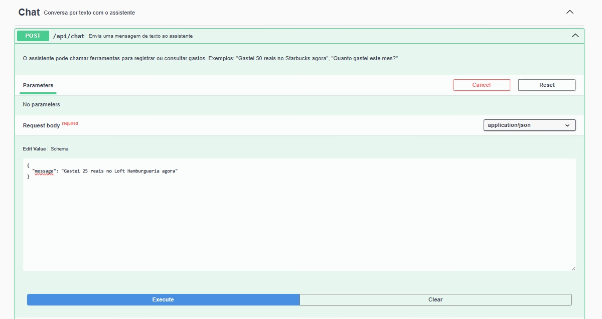

Repare em três coisas antes de executar:

- **A descrição em cinza** no topo (*"O assistente pode chamar ferramentas..."*) veio da
  anotação `@Operation` no controller
- **`Request body required`** — o corpo é obrigatório, e o Swagger sabe disso pelo `@RequestBody`
- **A aba `Schema`**, ao lado de `Edit Value`, mostra o formato esperado com os tipos

Clique em **`Execute`**.

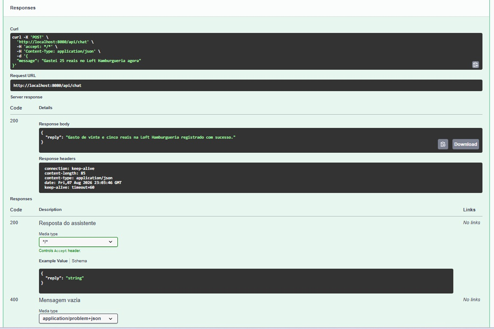

```json
{
  "reply": "Gasto de vinte e cinco reais na Loft Hamburgueria registrado com sucesso."
}
```

**O que aconteceu por baixo:** o assistente interpretou a frase, escolheu a ferramenta
`registrarGasto`, extraiu valor, local e categoria, e o Java executou um `INSERT`.
Confira no terminal da aplicação — a linha `[TOOL] registrarGasto -> Transaction[...]`
está lá. O Swagger é só o cliente; o pipeline é o mesmo de sempre.

---

## Exercício 2 — consultar o total

Sem sair do `/api/chat`, troque a mensagem por uma pergunta:

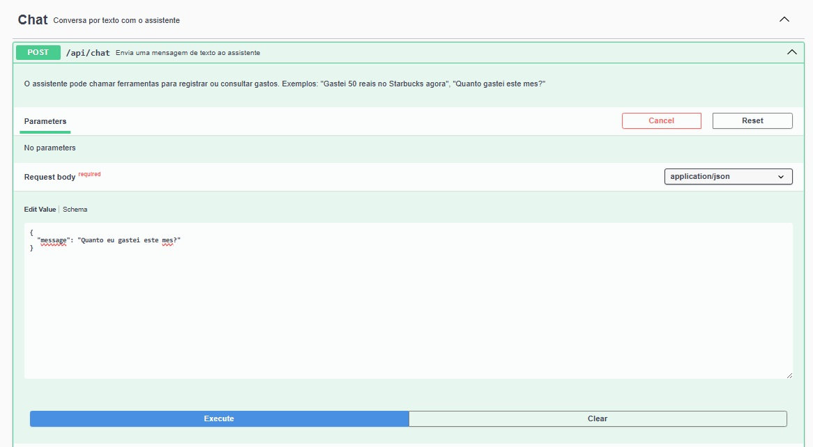

**`Execute`**.

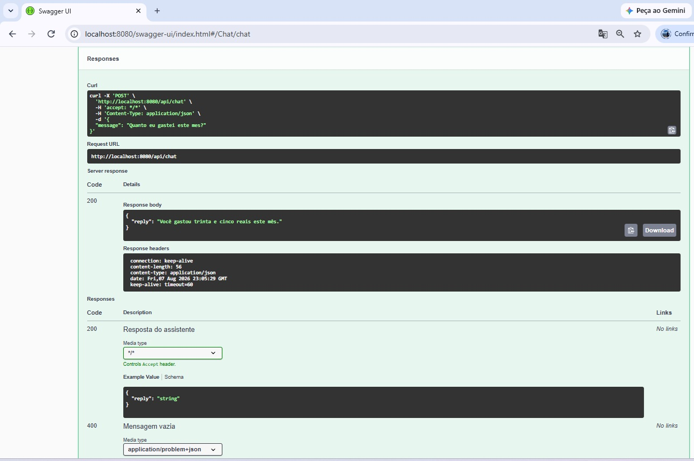

```json
{
  "reply": "Você gastou trinta e cinco reais este mês."
}
```

Dois `Execute` seguidos acabaram de demonstrar **escrita e leitura** no banco, por linguagem
natural, sem terminal nenhum.

> **Por que 35 e não 25?** O total soma **tudo** que está no banco no mês, e nesta execução
> já havia outro gasto registrado antes. A ferramenta `consultarTotalDoPeriodo` fez
> `SELECT` no intervalo do mês inteiro — não é o eco do último registro.
> Para conferir, abra o `http://localhost:8080/h2-console` e rode `SELECT * FROM TRANSACTIONS;`

**A prova de que não é alucinação** é justamente essa: se o modelo estivesse inventando,
o número mais provável seria repetir o 25 que ele acabou de ver na conversa.

---

## Exercício 3 — provocar um erro

Agora o caminho infeliz. Deixe a mensagem vazia:

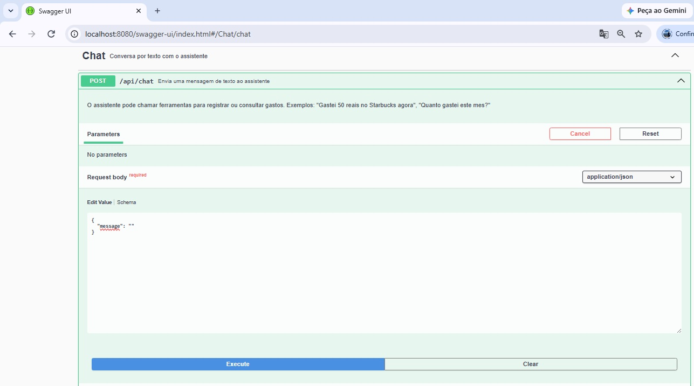

**`Execute`**.

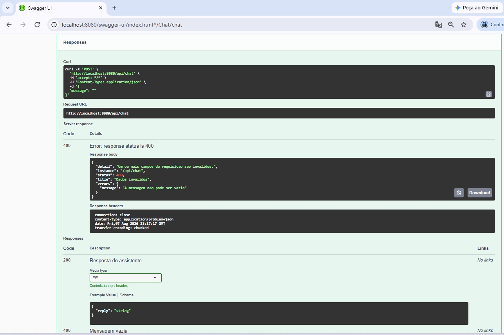

```json
{
  "detail": "Um ou mais campos da requisicao sao invalidos.",
  "instance": "/api/chat",
  "status": 400,
  "title": "Dados invalidos",
  "errors": {
    "message": "A mensagem nao pode ser vazia"
  }
}
```

Três detalhes que valem observar:

**`content-type: application/problem+json`** nos cabeçalhos — não é JSON genérico, é o
formato padronizado pela [RFC 7807](https://datatracker.ietf.org/doc/html/rfc7807).
Qualquer cliente que fale esse padrão sabe interpretar sem documentação extra.

**O campo `errors`** diz **qual** campo falhou e **por quê**. Sem ele, a resposta seria um
`"Invalid request content."` genérico e o cliente ficaria adivinhando.

**A tabela `Responses` já anunciava esse 400** com a descrição *"Mensagem vazia"*, escrita
no `@ApiResponse` do controller. **Contrato e comportamento batendo** — é isso que uma boa
documentação de API significa. Compare os dois blocos na imagem: em cima o que aconteceu,
embaixo o que estava prometido.

---

## Exercício 4 — o pipeline de voz

Expanda **Assistente de voz → `POST /api/assistant/voice`** e clique em **`Try it out`**.

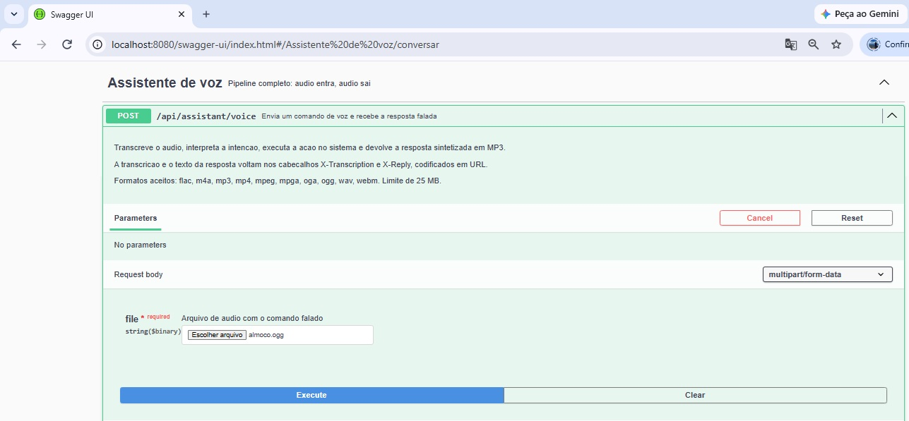

Aqui o campo `file` virou um botão **`Escolher arquivo`**, e não uma caixa de texto. Isso é
efeito direto da anotação no controller:

```java
@Parameter(description = "Arquivo de audio com o comando falado",
        content = @Content(mediaType = MediaType.MULTIPART_FORM_DATA_VALUE,
                schema = @Schema(type = "string", format = "binary")))
```

Note o `string($binary)` abaixo de `file` na imagem — é o OpenAI dizendo "isto é um arquivo".

Selecione `src/test/resources/audio/almoco.ogg` e **`Execute`**.

> Leva **~8 segundos**. São quatro chamadas à OpenAI: transcrição, o modelo pedindo a
> ferramenta, o modelo gerando a resposta final, e a síntese de voz.

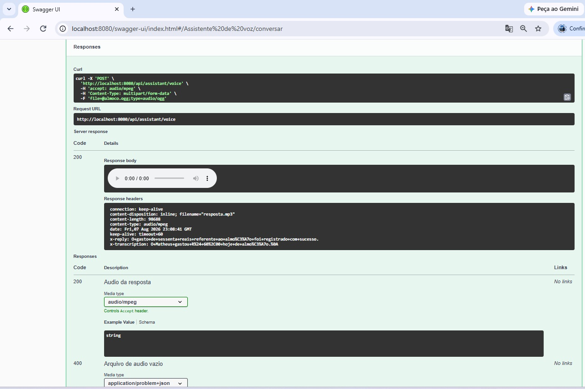

### O que a resposta traz

**Um player de áudio** no `Response body` — o Swagger UI reconhece `audio/mpeg` e renderiza
o controle nativo. Clique no ▶ para ouvir sem baixar.

**Os cabeçalhos**, onde está o pipeline inteiro visível de uma vez:

```
content-type:     audio/mpeg
content-length:   98688
x-transcription:  O+Matheus+gastou+R%24+60%2C00+hoje+de+almo%C3%A7o.%0A
x-reply:          O+gasto+de+sessenta+reais+referente+ao+almo%C3%A7o+foi+registrado+com+sucesso.
```

Decodificando:

| Cabeçalho | Valor real |
|---|---|
| `x-transcription` | "O Matheus gastou R$ 60,00 hoje de almoço." |
| `x-reply` | "O gasto de sessenta reais referente ao almoço foi registrado com sucesso." |

O `%C3%A7` é o `ç` e o `%24` é o `$`. Cabeçalho HTTP só aceita ASCII, então o controller
codifica em URL — por isso o `URLEncoder` no código.

**Repare na diferença entre os dois:** a entrada tem `R$ 60,00` porque é a transcrição fiel
do que foi falado. A saída tem `"sessenta reais"` porque o system prompt manda escrever
valores por extenso — a resposta vai virar áudio, e `R$ 60,00` soaria estranho falado.

---

## Exercício 5 — isolar a transcrição

Os dois endpoints seguintes expõem **etapas isoladas** do pipeline. Eles não existem para o
usuário final: existem para você depurar.

Expanda **Transcricao → `POST /api/transcribe`** → `Try it out` → escolha o mesmo
`almoco.ogg` do exercício 4.

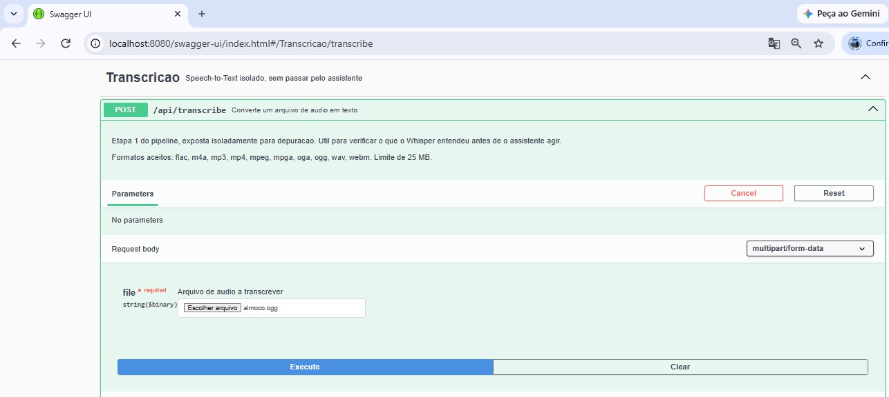

**`Execute`**.

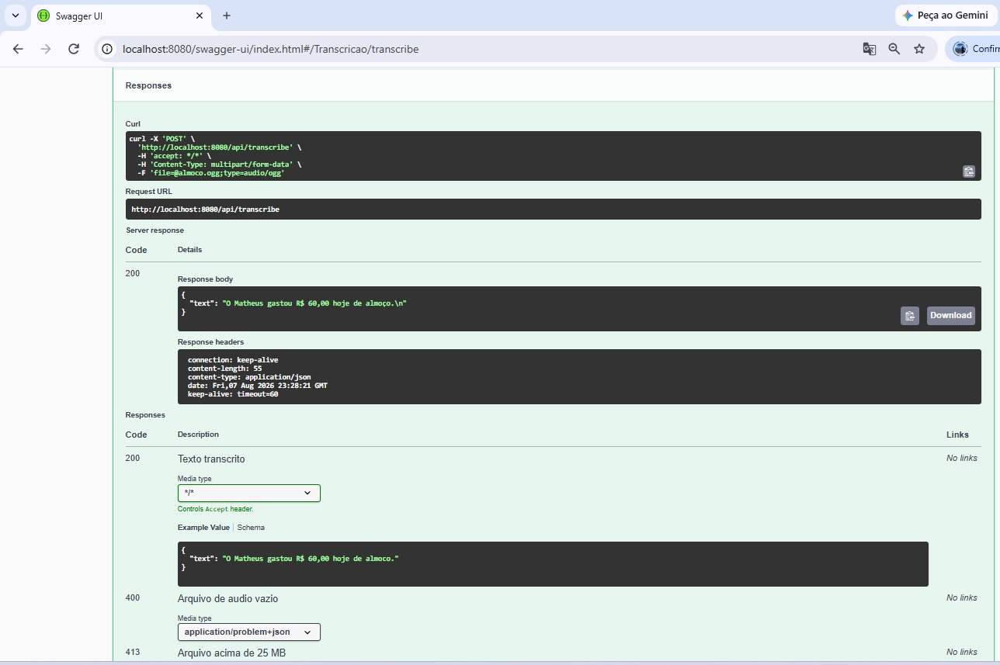

```json
{ "text": "O Matheus gastou R$ 60,00 hoje de almoço.\n" }
```

### Por que esse endpoint importa

Quando o assistente responde algo estranho, existem duas hipóteses: **o Whisper ouviu
errado** ou **o modelo interpretou errado**. Sem separar as etapas, você fica adivinhando.

Mandar o mesmo áudio aqui responde a primeira metade da pergunta em 2 segundos, sem gastar
as chamadas de chat e de síntese. Se o texto veio certo, o problema está no prompt ou nas
ferramentas — não no áudio.

### Dois detalhes visíveis no print

**O `\n` no fim da transcrição.** O Whisper devolve a frase com quebra de linha. É o mesmo
`%0A` que apareceu no `x-transcription` do exercício 4, agora sem codificação de URL, bem
mais óbvio. Não quebra nada, mas é sujeira — resolvida com um `.strip()` no
`TranscriptionService`.

**A diferença entre `Response body` e `Example Value`.** Compare os dois blocos na imagem:

| Bloco | Conteúdo | O que é |
|---|---|---|
| `Response body` | `"...de almoço.\n"` | o que **realmente** voltou agora |
| `Example Value` | `"...de almoco."` | o exemplo do `@Schema` no código |

O exemplo é ilustração; o corpo é o fato. Não confunda os dois ao ler qualquer Swagger.

---

## Exercício 6 — ouvir uma decisão de design

Este é o exercício mais interessante do guia, porque você vai **medir** uma escolha de
prompt que parecia subjetiva.

Expanda **Sintese de voz → `POST /api/synthesize`** → `Try it out`.

### Primeiro, por extenso

```json
{ "text": "Voce gastou sessenta reais este mes." }
```

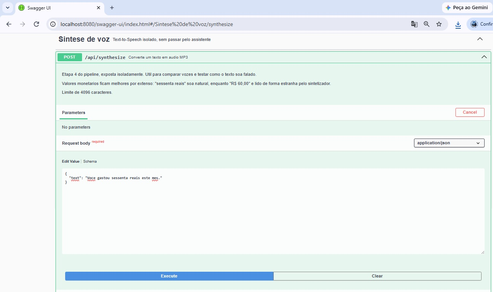

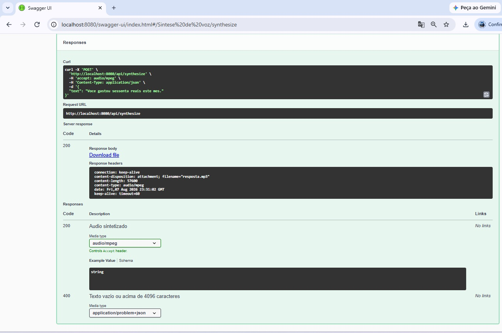

Guarde o número: **`content-length: 57600`**.

### Agora com símbolo e numeral

```json
{ "text": "Voce gastou R$ 60,00 este mes." }
```

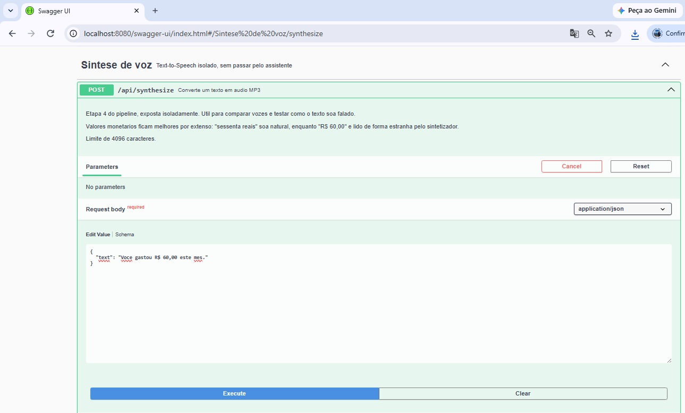

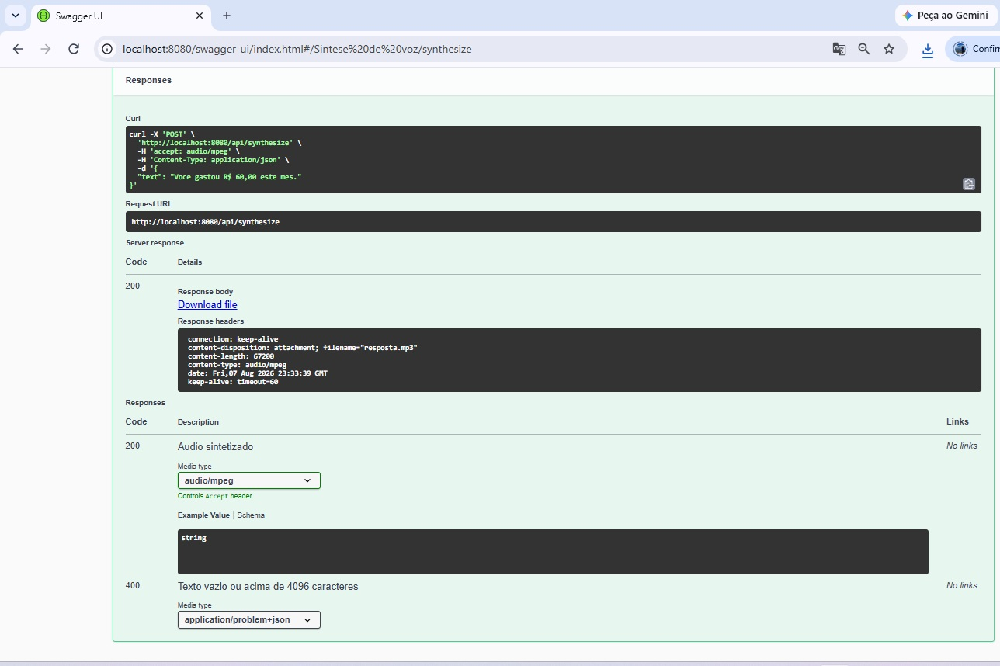

**`content-length: 67200`.**

### O que os números provam

| Texto enviado | Caracteres | Bytes de áudio |
|---|---|---|
| `Voce gastou sessenta reais este mes.` | 36 | **57.600** |
| `Voce gastou R$ 60,00 este mes.` | 30 | **67.200** |

O segundo texto é **mais curto em caracteres** e gerou **9.600 bytes a mais de áudio** — cerca
de **0,6 segundo** a 128 kbps.

O motivo é que o sintetizador não lê `R$ 60,00` como "sessenta reais". Ele soletra algo
próximo de *"erre cifrão sessenta vírgula zero zero"* — mais sílabas, mais áudio, e uma
frase que soa artificial.

Baixe os dois MP3 e ouça. A diferença é imediata.

**Isso valida objetivamente a regra que está no `SYSTEM_PROMPT` desde o começo:**

```
- Escreva os valores por extenso, nunca com simbolo ou numeral.
  Escreva "sessenta reais". Nunca escreva "R$ 60,00" nem "60 reais".
```

Aquela regra parecia preciosismo. Aqui ela vira número: **17% menos áudio** e uma frase que
soa humana. É o mesmo texto que aparece no `x-reply` do exercício 4 — o assistente já
responde assim por padrão.

### Um detalhe de HTTP escondido no print

Repare que aqui o `Response body` mostra um link **`Download file`**, enquanto no exercício 4
apareceu um **player de áudio**. Os dois devolvem `audio/mpeg` — o que muda é uma linha em
cada controller:

```java
// TextToSpeechController  → o navegador baixa
ContentDisposition.attachment().filename("resposta.mp3")

// VoiceAssistantController → o navegador toca
ContentDisposition.inline().filename("resposta.mp3")
```

O cabeçalho `Content-Disposition` é quem decide se o navegador **exibe** ou **baixa** um
arquivo. Faz sentido assim: o `/api/synthesize` existe para você gerar um arquivo, e o
`/api/assistant/voice` é uma conversa — nesse, ouvir na hora é o comportamento natural.

---

## 9. Como ler uma resposta

Depois de cada `Execute`, o Swagger mostra cinco blocos. Vale saber para que serve cada um:

| Bloco | Para que serve |
|---|---|
| **Curl** | O comando equivalente, pronto para copiar. Use para documentar ou automatizar |
| **Request URL** | A URL exata que foi chamada |
| **Server response · Code** | O status HTTP que **realmente** voltou |
| **Response body** | O corpo da resposta (ou o player, se for áudio) |
| **Response headers** | Onde moram `x-transcription`, `x-reply` e `content-type` |
| **Responses** (abaixo) | O **contrato documentado** — todos os status possíveis, com descrição |

A distinção mais importante é entre os dois últimos:

- **`Server response`** = o que aconteceu **agora**, nesta requisição
- **`Responses`** = o que **pode** acontecer, segundo a documentação

Quando os dois divergem, ou o código mudou sem atualizar a anotação, ou existe um caminho
de erro que ninguém documentou.

---

## 10. O JSON por trás da interface

A barra escura no topo da página aponta para **`/v3/api-docs`**. Aquilo é o contrato bruto,
em OpenAPI 3.1 — e a interface bonita é só **uma** das formas de consumi-lo.

```bash
curl http://localhost:8080/v3/api-docs
```

Com esse JSON, sem escrever nada, dá para:

- **Importar no Postman ou Insomnia** — a coleção inteira aparece pronta
- **Gerar um cliente** em Java, TypeScript, Python ou Go com o `openapi-generator`
- **Gerar os tipos** de um front-end
- **Validar em CI** que uma mudança não quebrou o contrato

É por isso que anotar os controllers vale a pena: o esforço não fica só na página de
documentação, ele vira insumo para ferramentas.

---

## 11. Limitações

Coisas que o Swagger UI **não** faz bem, e o que usar no lugar:

**A duração do áudio aparece como `0:00`.** O MP3 gerado pela OpenAI não traz o cabeçalho
`Xing`, que guarda a contagem de frames, e o Swagger serve o áudio como `blob:` — sem
*range requests*, o navegador não consegue medir a duração sem decodificar tudo. **O áudio
toca normalmente** (o contador da esquerda avança) e a duração aparece certa em qualquer
player fora do navegador.

**Uploads grandes travam a interface.** Perto do limite de 25 MB, prefira `curl`.

**Não há histórico.** Cada `Execute` substitui o anterior. Para guardar cenários de teste,
use um arquivo `.http` (IntelliJ) ou uma coleção do Postman importada do `/v3/api-docs`.

**Não substitui teste automatizado.** O Swagger é exploração manual. A garantia de que nada
quebrou vem dos [17 testes automatizados](../README.md#testes) — `./mvnw test`.

---

← [voltar ao README principal](../README.md)
